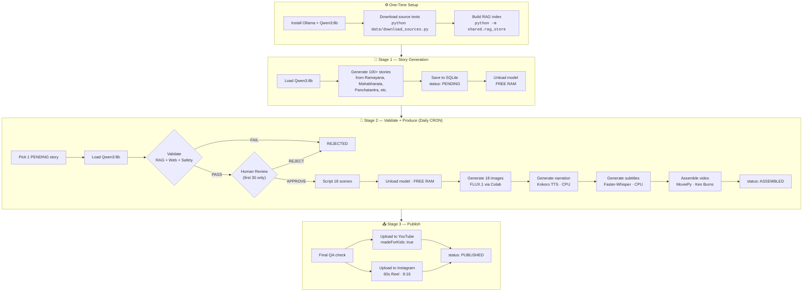

# 🎬 Mythological Stories — AI Video Pipeline

Automated pipeline to generate animated kids videos from Indian mythology and publish to YouTube & Instagram Reels. 100% open-source, near-zero cost.

**Target Audience:** Children aged 4-10
**Output:** YouTube (7-8 min, 16:9) + Instagram Reels (60 sec, 9:16)
**Hardware:** MacBook 16GB RAM
**Cost:** ~$5-10 for 100 videos

---

## Pipeline Flow



### Story Status Flow

```
PENDING → VALIDATED → SCRIPTED → MEDIA_DONE → ASSEMBLED → PUBLISHED
                ↓
            REJECTED
```

---

## Tech Stack

| Component | Tool | Cost |
|:--|:--|:--|
| LLM | Ollama + Qwen3:8b | $0 |
| RAG Fact-Check | ChromaDB + source text PDFs | $0 |
| Web Search | DuckDuckGo (Python) | $0 |
| Image Gen | Google Colab free + FLUX.1-dev | $0 |
| TTS | Kokoro TTS (82M, CPU) | $0 |
| Subtitles | Faster-Whisper (CPU) | $0 |
| Video Assembly | MoviePy + FFmpeg | $0 |
| Music | Royalty-free downloads | $0 |
| Database | SQLite | $0 |
| Orchestration | Python scripts + CRON | $0 |
| Publishing | YouTube/Instagram APIs | $0 |

---

## Quick Start

### 1. Install Prerequisites

```bash
# Ollama (local LLM runtime)
brew install ollama
ollama serve                   # Start server in background

# Pull models (~5GB each, one-time)
ollama pull qwen3:8b           # Creative writing, scripting, validation

# FFmpeg (video encoding)
brew install ffmpeg

# Python environment
cd /Users/sanjusingh/workspace/youtube-channel-001
python3 -m venv .venv
source .venv/bin/activate
pip install -r requirements.txt
```

### 2. Setup RAG Knowledge Base

```bash
# Auto-download public domain mythology texts (Ramayana, Mahabharata, etc.)
python data/download_sources.py

# Index into ChromaDB vector store (one-time, ~1 min)
python -m shared.rag_store
```

### 3. Run Stage 1 — Generate Stories

```bash
python stage1/generate_stories.py
```

- Generates 100+ stories across 12 mythology source sections
- Each story: 800-1000 words with moral lesson
- Saves to SQLite with status `PENDING`
- Takes ~2-3 hours on 16GB Mac (one-time)

### 4. Run Stage 2 — Process One Story

```bash
python stage2/main.py
```

Processes one `PENDING` story through the full pipeline:

| Step | Tool | RAM | What Happens |
|:--|:--|:--|:--|
| 1. Validate | Qwen3:8b + ChromaDB + DuckDuckGo | ~6GB | Fact-check, safety, moral, human review |
| 2. Script | Qwen3:8b | ~6GB | Break into 18 scenes with image prompts |
| 3. Images | Google Colab (external) | 0 | Generate 18 images via FLUX.1-dev |
| 4. Voice | Kokoro TTS | ~300MB | 8-min narration WAV |
| 5. Subtitles | Faster-Whisper | ~500MB | SRT file from narration |
| 6. Assemble | MoviePy + FFmpeg | ~1GB | Ken Burns video with audio + subs |

**RAM Management:** Model loads/unloads between steps. Only one heavy model in RAM at a time.

### 5. Run Stage 3 — Publish

```bash
python stage3/youtube_upload.py
python stage3/instagram_upload.py
```

### 6. Automate (Optional)

```bash
# Daily CRON: process + publish one story at 6 AM
crontab -e
0 6 * * * cd /Users/sanjusingh/workspace/youtube-channel-001 && .venv/bin/python stage2/main.py && .venv/bin/python stage3/youtube_upload.py
```

---

## Project Structure

```
youtube-channel-001/
├── README.md                # This file
├── requirements.txt
├── config/
│   └── settings.py          # Model names, paths, video specs
├── data/
│   ├── download_sources.py  # Auto-downloads public domain texts
│   ├── rag_sources/         # Downloaded/manual mythology texts
│   └── chroma_db/           # Auto-generated vector store
├── stage1/
│   └── generate_stories.py  # Bulk story generation (Ollama + Qwen3)
├── stage2/
│   ├── main.py              # Daily orchestrator (sequential, RAM-managed)
│   ├── agents/
│   │   └── validator.py     # RAG + web fact-check + safety + human review
│   ├── generators/
│   │   ├── scripter.py      # Scene breakdown + image prompts
│   │   ├── image_gen.py     # ComfyUI/Colab image generation
│   │   └── voice_gen.py     # Kokoro TTS narration
│   ├── assembly/
│   │   ├── video_builder.py # Ken Burns + stitching
│   │   └── subtitles.py     # Faster-Whisper subtitle burn-in
│   └── templates/
│       ├── intro.png        # Channel intro card
│       └── moral_card.png   # "Moral of the story" end card
├── stage3/
│   ├── youtube_upload.py    # YouTube Data API v3
│   └── instagram_upload.py  # Instagram Graph API
├── shared/
│   ├── db.py                # SQLite helpers
│   ├── ollama_utils.py      # Load/unload model helpers
│   ├── rag_store.py         # ChromaDB RAG indexer + query
│   └── logger.py
├── output/                  # Generated per-story output
│   └── {story_id}/
│       ├── images/
│       ├── audio/
│       └── video/
└── assets/
    ├── music/               # Royalty-free BGM files
    └── fonts/               # Kid-friendly fonts for subtitles
```

---

## Database Schema

```sql
CREATE TABLE stories (
    id INTEGER PRIMARY KEY AUTOINCREMENT,
    title TEXT NOT NULL,
    source TEXT,           -- "Ramayana", "Panchatantra", etc.
    characters TEXT,       -- JSON array
    full_story TEXT,       -- 800-1000 words
    moral TEXT,
    tags TEXT,             -- JSON array
    scenes TEXT,           -- JSON array of scene objects (after scripting)
    status TEXT DEFAULT 'PENDING',
    validation_result TEXT, -- JSON
    youtube_url TEXT,
    instagram_url TEXT,
    created_at TIMESTAMP DEFAULT CURRENT_TIMESTAMP,
    published_at TIMESTAMP
);
```

---

## Stage Details

### Stage 1: Story Generation

**Run:** `python stage1/generate_stories.py`
**Model:** Qwen3:8b via Ollama
**Output:** 100+ stories in SQLite

Sources covered:
1. Ramayana — all 6 Kandas
2. Mahabharata — Adi, Sabha, Vana, Bhishma Parvas
3. Bhagavata Purana — Krishna childhood
4. Panchatantra — all 5 tantras
5. Hitopadesha — Mitra Labha, Mitra Bheda
6. Jataka Tales — selected animal fables

### Stage 2: Validation + Media Production

**Run:** `python stage2/main.py` (daily, processes 1 story)

#### Validation (4 checks)

| Check | Method | Fail Action |
|:--|:--|:--|
| Mythological accuracy | RAG against source texts + DuckDuckGo | REJECT |
| Content safety | LLM checks for violence, adult themes | REJECT or auto-rewrite |
| Moral validation | LLM verifies moral matches story | Suggest alternative |
| Human review | CLI prompt (first 30 stories only) | REJECT if human says no |

Set `HUMAN_REVIEW_FIRST_N = 0` in `stage2/agents/validator.py` to skip human review.

#### Scene Scripting

Breaks story into 18 scenes, each with:
- `narration_text` — narrator dialogue
- `image_prompt` — FLUX.1 prompt (always "3D Pixar style" prefix)
- `duration_seconds` — 20-30 sec per scene
- `camera_motion` — slow_zoom_in, slow_zoom_out, pan_left, pan_right

#### Image Generation

Uses Google Colab free tier with FLUX.1-dev (GGUF Q5) on T4 GPU.
18 images at 1920x1080 + 5 at 1080x1920 for Instagram.

#### Voice + Subtitles + Assembly

- **Kokoro TTS** — CPU-only, warm narrator voice, 0.9x speed
- **Faster-Whisper** — auto-generates SRT subtitles
- **MoviePy** — Ken Burns zoom/pan, crossfades, burned-in subs, intro/outro cards

### Stage 3: Publishing

- **YouTube** — Data API v3, `madeForKids: true` (COPPA required), SEO tags
- **Instagram** — Graph API, 60s reel, moral in caption

---

## RAM Management (16GB Mac)

Only one heavy model in RAM at any time. Sequential execution with explicit unloading.

```python
load_model("qwen3:8b")     # Load ~6GB
# ... validate + script ...
unload_all()                # Free RAM
# ... Kokoro TTS (300MB) ...
# ... Whisper (500MB) ...
# ... MoviePy (1GB) ...
```

See `shared/ollama_utils.py` for implementation.

---

## Cost Summary

| Item | Cost |
|:--|:--|
| All tools (local, open-source) | $0 |
| Electricity (~50 hrs compute) | ~$5 |
| VPS for CRON (optional) | $0-5/mo |
| **100 videos total** | **$5-10** |

---

## 6-Week Roadmap

| Week | Task |
|:--|:--|
| 1 | Install Ollama + Qwen3. Run Stage 1, generate 100 stories |
| 2 | Build validator agent with RAG + DuckDuckGo search |
| 3 | Set up Colab notebook for FLUX.1 images + Kokoro TTS |
| 4 | MoviePy assembly: Ken Burns, subtitles, intro/outro cards |
| 5 | YouTube + Instagram API integration |
| 6 | CRON automation, first 10 videos published |

---

## Future Upgrades

- Replace Kokoro → ElevenLabs for more expressive voices
- Replace Colab images → local GPU or Kling AI animated clips
- Add Wan2.2 for actual AI animation (instead of Ken Burns on stills)
- Add Hindi narration track for Indian audience
- Add thumbnail generation with click-bait text overlay
- Add Gradio/Streamlit dashboard for visual story review

---

## License

All tools used are open-source. Source texts are public domain (pre-1929 translations).
Content generated by the pipeline is original AI output.
Consult a lawyer regarding COPPA compliance before publishing kids content on YouTube.
